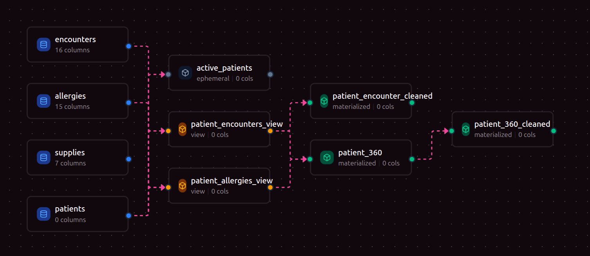

 
# DLO - Data Lineage Orchestrator


[](https://opensource.org/licenses/Apache-2.0)
[](https://www.python.org/downloads/)
[](https://github.com/yourusername/dlo)

**Modern AI-consumable Context-optimized ELT orchestration**

DLO is a declarative data orchestration platform that compiles SQL-based transformations into executable pipelines with automatic dependency resolution, scheduling, and comprehensive lineage tracking. Designed for data engineers who want the simplicity of dbt-style workflows with the power of programmatic orchestration and AI integration.

## Key Features

- **Declarative Configuration** - Define data models, sources, and transformations in YAML + SQL
- **Automatic Dependency Resolution** - SQL parsing extracts table references to build execution DAGs
- **Multiple Model Types** - Materialized tables, views, and ephemeral CTEs
- **Smart Scheduling** - Cron-based scheduling with dependency-aware execution
- **Column-Level Metadata** - Rich metadata including descriptions, tags, profiling metrics, and sample data
- **Semantic Layer** - Define reusable metrics and relationships
- **Interactive Web UI** - Browse models, explore lineage graphs, and search resources
- **AI Integration** - Model Context Protocol (MCP) server for AI assistant integration
- **Platform Adapters** - Extensible architecture with Databricks support (more coming soon)
- **Graph Visualization** - Automatic DAG generation with matplotlib

## Data Lineage Visualization

DLO automatically tracks and visualizes data lineage across your entire pipeline:



*Example: Healthcare data pipeline showing source tables (encounters, allergies, supplies, patients) flowing through views into materialized tables, with automatic dependency tracking and relationship visualization.*

## Installation

### Prerequisites

- Python 3.10 or higher
- A supported data platform (currently Databricks)

### Install from Source

```bash
# Clone the repository
git clone https://github.com/yourusername/dlo.git
cd dlo

# Install using uv (recommended)
pip install uv
uv sync

# Or install with pip in development mode
pip install -e .
```

### Optional Dependencies

Install additional features based on your needs:

```bash
# Databricks adapter
uv sync --group databricks
```

## Quick Start

### 1. Initialize Your Project

Create a new directory for your DLO project:

```bash
mkdir my_data_project
cd my_data_project
```

### 2. Create Configuration Files

**`config.yaml`** - Project configuration:

```yaml
name: healthcare_analytics
version: 1.0.0
profile: databricks_prod
```

**`profile.yaml`** - Connection profile (or place in `~/.config/dlo/profile.yaml`):

```yaml
databricks_prod:
  type: databricks
  host: https://your-workspace.cloud.databricks.com
  http_path: /sql/1.0/warehouses/your-warehouse-id
  catalog: main
  schema: healthcare
  
  # Authentication (choose one)
  token: your-personal-access-token
  # OR
  client_id: your-client-id
  client_secret: your-client-secret
```

### 3. Define Data Sources

**`sources/encounters.yaml`**:

```yaml
name: encounters
description: Patient encounters from EHR system
materialization: source
target:
  catalog: raw
  schema: healthcare
  table: encounters
columns:
  - name: encounter_id
    type: string
    description: Unique encounter identifier
    primary_key: true
  - name: patient_id
    type: string
    description: Patient identifier
  - name: encounter_date
    type: timestamp
    description: Date and time of encounter
  - name: encounter_type
    type: string
    description: Type of encounter (inpatient, outpatient, etc.)
  - name: provider_id
    type: string
    description: Attending provider identifier
```

**`sources/patients.yaml`**:

```yaml
name: patients
description: Patient demographic information
materialization: source
target:
  catalog: raw
  schema: healthcare
  table: patients
columns:
  - name: patient_id
    type: string
    description: Unique patient identifier
    primary_key: true
  - name: first_name
    type: string
    description: Patient first name
  - name: last_name
    type: string
    description: Patient last name
  - name: date_of_birth
    type: date
    description: Patient date of birth
  - name: status
    type: string
    description: Patient status (active, inactive, deceased)
```

### 4. Write SQL Transformations

**`sql/patient_encounters_view.sql`**:

```sql
SELECT 
    e.encounter_id,
    e.patient_id,
    e.encounter_date,
    e.encounter_type,
    e.provider_id,
    p.first_name,
    p.last_name,
    p.date_of_birth
FROM encounters e
JOIN patients p ON e.patient_id = p.patient_id
WHERE e.encounter_date >= CURRENT_DATE - INTERVAL 2 YEAR
```

**`sql/patient_360.sql`**:

```sql
SELECT 
    p.patient_id,
    p.first_name,
    p.last_name,
    p.date_of_birth,
    COUNT(DISTINCT e.encounter_id) as total_encounters,
    MAX(e.encounter_date) as last_encounter_date,
    COUNT(DISTINCT a.allergy_id) as total_allergies
FROM patients p
LEFT JOIN patient_encounters_view e ON p.patient_id = e.patient_id
LEFT JOIN allergies a ON p.patient_id = a.patient_id
GROUP BY p.patient_id, p.first_name, p.last_name, p.date_of_birth
```

### 5. Define Data Models

**`models/patient_encounters_view.yaml`**:

```yaml
name: patient_encounters_view
description: Denormalized view of patient encounters with demographics
materialization: view
target:
  catalog: analytics
  schema: healthcare
  table: patient_encounters_view
sql_path: sql/patient_encounters_view.sql
columns:
  - name: encounter_id
    type: string
    description: Unique encounter identifier
  - name: patient_id
    type: string
    description: Patient identifier
  - name: encounter_date
    type: timestamp
    description: Encounter date and time
```

**`models/patient_360.yaml`**:

```yaml
name: patient_360
description: Comprehensive patient profile with aggregated metrics
materialization: materialized
target:
  catalog: analytics
  schema: healthcare
  table: patient_360
sql_path: sql/patient_360.sql
schedule: "0 2 * * *"  # Daily at 2 AM
columns:
  - name: patient_id
    type: string
    description: Unique patient identifier
    primary_key: true
  - name: total_encounters
    type: integer
    description: Total number of patient encounters
    profiling:
      min: 0
      max: 150
      mean: 8.5
```

### 6. Compile and Run

```bash
# Compile the project - generates manifest and dependency graph
dlo compile

# Run all models in dependency order
dlo run

# Run specific models
dlo run --select patient_360

# Schedule models as jobs on your data platform
dlo schedule
```

### 7. Explore with Web UI

```bash
# Start the web server
dlo serve

# Or start in development mode with hot reload
dlo serve --dev

# Access at http://localhost:6364
```

## Architecture

DLO consists of several integrated components:

### Core Components

- **CLI** - Command-line interface for all operations (`dlo compile`, `dlo run`, etc.)
- **Compiler** - Parses YAML/SQL files, builds dependency graphs, generates compiled SQL
- **Parser** - Validates configurations and extracts SQL table dependencies using sqlglot
- **Runtime** - Orchestrates compilation, execution, and scheduling
- **Graph Builder** - Creates NetworkX DAGs and generates visualizations

### Integration Layer

- **Adapters** - Platform-specific implementations (Databricks, with more coming)
- **API Server** - FastAPI backend serving manifest data
- **Web UI** - React + TypeScript frontend for exploration and visualization
- **MCP Server** - Model Context Protocol integration for AI assistants
- **Vector Store** - Optional embeddings for semantic search

### Data Model

- **Manifest** - Central registry of all project resources
- **Models** - Data transformations (materialized, view, ephemeral)
- **Sources** - External tables and datasets
- **Metrics** - Reusable business calculations
- **Relationships** - Documented connections between models

## Usage Guide

### CLI Commands

#### Compile Project

```bash
# Compile and generate manifest
dlo compile

# Compile with specific project/profile
dlo compile --project-dir ./my_project --profile prod
```

#### Run Models

```bash
# Run all models
dlo run

# Run specific models
dlo run --select model_name

# Run with specific adapter profile
dlo run --profile databricks_prod
```

#### Schedule Jobs

```bash
# Create scheduled jobs for all models with schedules
dlo schedule

# Schedule specific models
dlo schedule --select patient_360
```

#### Start Web UI

```bash
# Production mode (serves built React app)
dlo serve

# Development mode (Vite dev server with HMR)
dlo serve --dev

# Custom host and port
dlo serve --host 0.0.0.0 --port 8080

# With multiple workers
dlo serve --workers 4
```

#### Start MCP Server

```bash
# Start MCP server for AI integration
dlo mcp
```

#### Execute Queries

```bash
# Run ad-hoc SQL query
dlo query "SELECT * FROM patients LIMIT 10"
```

#### Version Information

```bash
# Show DLO version
dlo version
```

### Model Types

DLO supports three model materialization types:

#### 1. Materialized Tables

Physical tables created in your data warehouse. Best for frequently accessed datasets.

```yaml
name: patient_360
materialization: materialized
target:
  catalog: analytics
  schema: healthcare
  table: patient_360
```

#### 2. Views

Virtual tables that execute the query on each access. Best for simple transformations.

```yaml
name: patient_encounters_view
materialization: view
target:
  catalog: analytics
  schema: healthcare
  table: patient_encounters_view
```

#### 3. Ephemeral Models

Never materialized - compiled as CTEs in downstream queries. Best for intermediate transformations.

```yaml
name: active_patients
materialization: ephemeral
```

### Scheduling

Schedule models using cron expressions:

```yaml
schedule: "0 2 * * *"  # Daily at 2 AM
```

Common patterns:
- `0 * * * *` - Every hour
- `0 0 * * *` - Daily at midnight
- `0 0 * * 0` - Weekly on Sunday
- `0 0 1 * *` - Monthly on the 1st

### Relationships

Document connections between models:

**`relationships/patient_encounters.yaml`**:

```yaml
name: patient_to_encounters
description: One patient can have many encounters
from_model: patients
to_model: patient_encounters_view
relationship_type: one_to_many
join_columns:
  - from: patient_id
    to: patient_id
```

### Metrics

Define reusable business metrics:

**`metrics/patient_metrics.yaml`**:

```yaml
name: active_patient_count
description: Count of active patients
model: patients
type: count
filters:
  - status = 'active'
dimensions:
  - status
  - date_of_birth
```

## Project Structure

A typical DLO project follows this structure:

```
my_project/
├── config.yaml              # Project configuration
├── profile.yaml            # Connection profiles (optional)
│
├── sources/                # Source definitions
│   ├── encounters.yaml
│   ├── allergies.yaml
│   ├── patients.yaml
│   └── supplies.yaml
│
├── models/                 # Model definitions
│   ├── patient_encounters_view.yaml
│   ├── patient_allergies_view.yaml
│   ├── patient_360.yaml
│   └── patient_encounter_cleaned.yaml
│
├── sql/                    # SQL transformation queries
│   ├── patient_encounters_view.sql
│   ├── patient_allergies_view.sql
│   ├── patient_360.sql
│   └── patient_encounter_cleaned.sql
│
├── relationships/          # Relationship definitions
│   └── patient_relationships.yaml
│
├── metrics/               # Metric definitions
│   └── patient_metrics.yaml
│
└── target/                # Generated files (gitignored)
    ├── manifest.json      # Compiled manifest
    ├── compiled/          # Compiled SQL with CTEs
    └── graphs/           # DAG visualizations
```

## Web UI

The DLO web interface provides an intuitive way to explore your data pipeline:

### Features

- **Dashboard** - Overview of models, sources, metrics, and relationships
- **Catalog Browser** - Navigate all resources with search and filtering
- **Lineage Graph** - Interactive visualization of data flow and dependencies
- **Detail Views** - Comprehensive information for each resource
- **Column Metadata** - View column descriptions, types, profiling stats, and sample data
- **Search** - Full-text search across all resources
- **Dark/Light Mode** - Comfortable viewing in any environment

### Access

Start the server and navigate to `http://localhost:6364`:

```bash
dlo serve
```

For development with hot module replacement:

```bash
dlo serve --dev
```

## Platform Support

### Databricks

Full support for Databricks with Unity Catalog:

**Features:**
- SQL Warehouse execution
- Unity Catalog (catalog.schema.table)
- Jobs API for scheduling
- OAuth2 and PAT authentication
- Task dependency management
- Workspace file operations

**Configuration:**

```yaml
databricks_prod:
  type: databricks
  host: https://your-workspace.cloud.databricks.com
  http_path: /sql/1.0/warehouses/warehouse-id
  catalog: main
  schema: analytics
  
  # Authentication
  token: your-pat-token
  # OR
  client_id: your-client-id
  client_secret: your-client-secret
  
  # Optional: Runtime configuration
  runtime:
    workspace_path: /Workspace/dlo
    job_cluster_key: dlo-cluster
```


## Development

### Setup Development Environment

```bash
# Clone and install
git clone https://github.com/yourusername/dlo.git
cd dlo

# Install with all development dependencies
uv sync --all-groups

# Install git hooks
lefthook install
```


### Project Structure

- `src/dlo/` - Main source code
  - `core/` - CLI, compiler, parser, models
  - `adapters/` - Platform-specific implementations
  - `api/` - FastAPI server
  - `ui/` - React frontend
  - `mcp/` - MCP server
  - `vector_store/` - Embeddings support
  - `common/` - Shared utilities
- `tests/` - Test suite
  - `unit/` - Unit tests
  - `integration/` - Integration tests (if any)
- `docs/` - Documentation


## License

DLO is licensed under the [Apache License 2.0](LICENSE).
